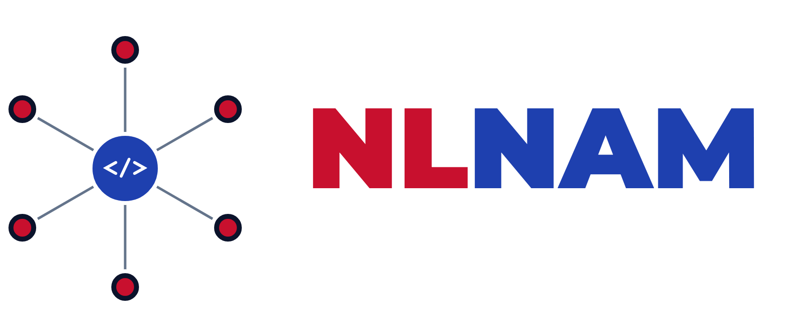
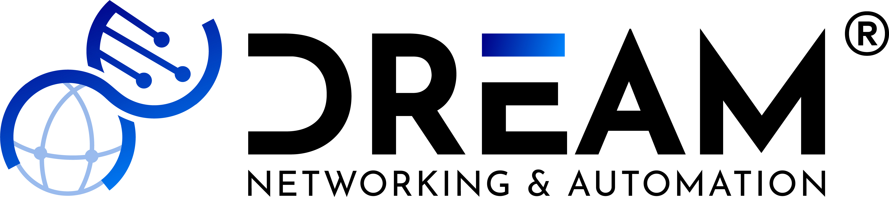
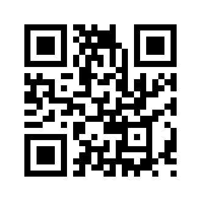

# NLNAM

## A Home for Network Automation
## in the Netherlands

<!--
I'm so excited to be here and being able to talk about NLNAM. What started as an idea between Dan Peachey and I at Autocon 3 in 2025, has now grown into a real community.
-->

---

## Bart Dorlandt

- Freelance Network Automation Solution Architect
- 20+ years in networking & automation
- Lives by: *"There must be a better way"*
- Co-organizer of PyUtrecht
- Advisory board member of Network Automation Forum (NAF)

<!--

-->

---

## So what is NLNAM?

> The **N**ether**L**ands **N**etwork **A**utomation **M**eetup

- A **volunteer-run community** — free to attend
- For **network engineers, DevOps, automationeers & developers**
- Regular meetups across the Netherlands: **talks + networking**

*A home for everyone automating (the network).*

<!--
There should be one of these in the Netherlands
-->

---

## Topics for the next event

- Zero Trust Automation: From Complexity to Control
- Network Automation Framework overview
- Using JSON schema to describe your data model and perform validation
- Manage a pan-european network with WFO and Ansible

<!--
- Infrastructure as Code
- Source of Truth
- Configuration Management
- (Network) Programming

- Monitoring & Observability
- Cloud Networking
- Validation & Testing
- Workflow Automation
-->

---

## Past & future meetups

| #   |      Date | Host              | Where           |
| --- | --------: | ----------------- | --------------- |
| 1   |     5 Feb | Adyen + Netpicker | Amsterdam       |
| 2   |    13 May | APNT              | Alphen a/d Rijn |
| 3   | **9 Sep** | **One Zero IT**   | **Utrecht**     |
| 4   |    26 Nov | Schuberg Philis   | Schiphol-Rijk   |
| 5   |   Feb '27 | Huawei            | Rijswijk        |

---
<!-- _class: closing -->

*Automating the future of (Dutch) Networking*

https://net-auto.nl/

<!--
I'm very excited and proud NLNAM now exists. I'm also looking for great topics and speakers. I welcome you to submit them and/or be part of the upcoming events.
-->
